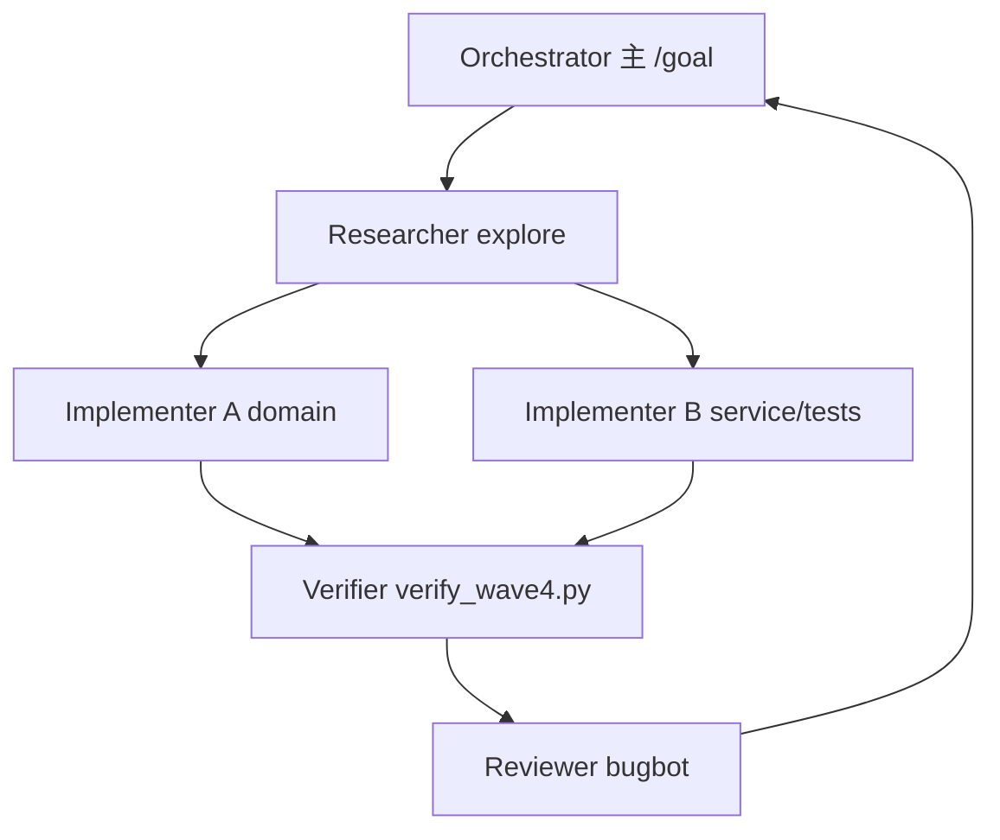

# Wave-4 算法深化计划 + `/goal` Mega 提示词（2026-08-22）

> 访问日期：2026-08-22（UTC+8）  
> 前置 Goal：[`goal-wave-2026-08-22-algorithm-wave3-infer-reliability.md`](goal-wave-2026-08-22-algorithm-wave3-infer-reliability.md)（Wave-2.5 + Wave-3 已全部 `[x]`）  
> 执行框架：[`goal-execution-framework.md`](goal-execution-framework.md)  
> 候选池：[`minitab-market-algorithm-backlog.md`](minitab-market-algorithm-backlog.md) §12、[`next-wave-algorithms-charts-ml-oss.md`](next-wave-algorithms-charts-ml-oss.md) §2–§3

---

## §0 给 Orchestrator 的一页摘要

| 维度 | 内容 |
|------|------|
| **本 Goal 名称** | Wave-4：质量表形补全 + 可靠性竞争风险 + 生存/Logistic 深化 |
| **Wave 数** | 2 个 Wave（Wave-4.0 前置补全 + Wave-4 四项竖切），**全部完成才 `UpdateGoal complete`** |
| **交付门** | `python tools/verify_algorithm_wave4_track.py` PASS |
| **人手门** | 用户在 Qt Creator **Rebuild + 跑测试**（agent **禁止**强跑 cmake/ctest；中文路径） |
| **子 Agent** | Researcher ×1 → Implementer ×2（分文件）→ Reviewer（bugbot）→ Verifier（verify 脚本）；互相监督见 §5 |
| **公式页** | G1 `FormulaRegistryDialog` 已存在；本 Wave **必须**为新增/深化命令补全 `algorithm_help.json` 公式块 + Primary URL |

### 已完成水位（勿重做）

| 批次 | 内容 | verify |
|------|------|--------|
| Wave-1/A1–A3 | best_subsets、logistic 深化、batch_capability | `verify_algorithm_batch` 类测试 |
| Wave-2 | nominal_logistic、nonparametric_capability、stepwise AICc/BIC、accelerated_life 窄化 | `verify_algorithm_wave2_track.py` |
| Wave-2.5 | nominal IRLS；ALT Newton MLE；测试补强 | `verify_algorithm_wave3_track.py`（硬门禁） |
| Wave-3 | bootstrap_two_sample；KM Log-rank K 组；ALT 使用应力预测；probit_reliability | `verify_algorithm_wave3_track.py` |
| G1/G2 | 公式注册表 UI、图表/表格复制 | 手工 acceptance |

---

## §1 架构与竖切框架（执行 agent 必守）

### 1.1 分层（禁止走样）

```
ui/（Qt 对话框、菜单、FormulaRegistryDialog）
  ↓ 仅通过 AnalysisConfiguration / ImportPlan
application/（AnalysisService、InterpretationService、GraphService）
  ↓ 调用纯 C++
domain/（statistics/、quality_types.h、Facts 结构）
  ↓
infrastructure/（output_serialization、database、report）
reporting/（PDF、chart_renderer）
```

**硬约束：**

- `domain/` **不得** `#include` Qt  
- `infrastructure/` **不得** `#include` `ui/`  
- 解释层 **只读** `OutputPage.facts`，禁止重算统计量  
- `formula_reference ≠ golden`；未导出禁止写 `VALIDATION_MATRIX.md`

### 1.2 单项竖切链路（顺序不可跳）

```
WebSearch Primary URL（Minitab support / NIST 优先）
  → docs/research/p4_*.md（访问日期 UTC+8）
  → src/domain/statistics/*.{h,cpp}
  → quality_types.h（*Configuration / *Facts）
  → analysis_service.{h,cpp}
  → analysis_commands.cpp（QStringLiteral command id）
  → interpretation_service.cpp + report_text_catalog_part*.cpp
  → output_serialization.cpp（JSON round-trip）
  → resources/help/algorithm_help.json（公式块 + references）
  → docs/algorithm-wiring-index.md
  → tests/algorithm_wave4_track_test.cpp（+ 必要时 hardening TU）
  → CMakeLists.txt
  → backlog §4/§9/§12 + comprehensive-analytics-roadmap + acceptance §2
  → tools/verify_algorithm_wave4_track.py
```

### 1.3 数据导入契约（A→B 必测）

| 契约 | 实现位置 | 测试要求 |
|------|----------|----------|
| **complete-case** | `extract_numeric_column` / service 对齐循环 | 缺测行不计入 N；diagnostic `missing_values` |
| **source_row** | 列提取返回 `source_rows` | Facts 或 domain 结果可审计；换表后行集合变 |
| **A→B 失效** | `configuration.excluded_rows` 不跨 ImportPlan 继承 | 表 A 有排除 → 表 B 必须 `excluded_rows.clear()` 后 N/指纹变化 |
| **hidden ≠ excluded** | `hidden_rows` 仅显示 | 禁止把 hidden 当 complete-case 排除 |
| **事件编码** | `parse_reliability_event` | 未知编码拒绝，禁止静默当删失 |

模板测试：[`tests/algorithm_batch_2026_08_test.cpp`](../tests/algorithm_batch_2026_08_test.cpp)、[`tests/algorithm_wave2_hardening_test.cpp`](../tests/algorithm_wave2_hardening_test.cpp)

### 1.4 禁止偷懒（Goal 启动时全文粘贴 §6）

1. 禁止只做 UI 壳不算 domain/Facts  
2. 禁止跳过 interpretation 与 catalog 双语  
3. 禁止把 Minitab 数值当 golden  
4. 禁止单页堆叠超过一层主流程控件（新功能独立页/对话框）  
5. 禁止破坏 `row_visibility` hidden/excluded 语义  
6. 禁止 infrastructure 新增对 ui 的 include  
7. 禁止合并 customer/engineer/audit 为单模板  
8. 禁止省略 help catalog / `algorithm_help.json`  
9. 禁止大 catalog 单 TU（>500 条）  
10. 禁止宣称 PDF/A·UA 合规无验证器  
11. 禁止每 Wave 强制停 Qt Creator 才允许下一 Wave  
12. **禁止 Goal 在只完成 1 个算法后标记 complete**  
13. **禁止跳过网上 Primary URL 调研**

---

## §2 优先阅读清单（新对话前 30 分钟）

### 2.1 必读文档（顺序）

| # | 路径 | 用途 |
|---|------|------|
| 1 | [`goal-execution-framework.md`](goal-execution-framework.md) | Wave 粒度、多 Agent、DoD |
| 2 | [`goal-wave-2026-08-22-algorithm-wave3-infer-reliability.md`](goal-wave-2026-08-22-algorithm-wave3-infer-reliability.md) | 上一 Goal 交付与教训 |
| 3 | [`minitab-market-algorithm-backlog.md`](minitab-market-algorithm-backlog.md) §4/§9/§12 | 缺口与 ✅ 水位 |
| 4 | [`next-wave-algorithms-charts-ml-oss.md`](next-wave-algorithms-charts-ml-oss.md) §0/§2/§3 | 框架硬约束、Track E–H |
| 5 | [`docs/algorithm-wiring-index.md`](../algorithm-wiring-index.md) | 命令 id ↔ service ↔ 测试 |
| 6 | [`samples/product_evolution/unified_track_acceptance_plan.md`](../../samples/product_evolution/unified_track_acceptance_plan.md) §2 | 签收表格式 |
| 7 | **本文件** §3–§4 | Wave-4 范围与调研摘要 |

### 2.2 必读代码（竖切模板）

| 场景 | 模板文件 |
|------|----------|
| 新增命令 | [`bootstrap_two_sample.cpp`](../src/domain/statistics/bootstrap_two_sample.cpp) + [`analysis_service.cpp`](../src/application/analysis_service.cpp) `bootstrap_two_sample` |
| 深化 reliability | [`reliability.cpp`](../src/domain/statistics/reliability.cpp) + [`censoring_contract.cpp`](../src/domain/statistics/censoring_contract.cpp) |
| IRLS/GLM | [`logistic_regression.cpp`](../src/domain/statistics/logistic_regression.cpp)、[`nominal_logistic.cpp`](../src/domain/statistics/nominal_logistic.cpp) |
| 能力分析 | [`nonparametric_capability.cpp`](../src/domain/statistics/nonparametric_capability.cpp) |
| 测试 TU | [`algorithm_wave3_track_test.cpp`](../tests/algorithm_wave3_track_test.cpp)、[`algorithm_batch_2026_08_test.cpp`](../tests/algorithm_batch_2026_08_test.cpp) |
| verify 脚本 | [`tools/verify_algorithm_wave3_track.py`](../tools/verify_algorithm_wave3_track.py) |
| 公式/help | [`resources/help/algorithm_help.json`](../resources/help/algorithm_help.json)、[`FormulaRegistryDialog`](../src/ui/formula_registry_dialog.cpp) |
| C++ 规范 | [`.agents/skills/cpp-coding/SKILL.md`](../../.agents/skills/cpp-coding/SKILL.md) |

### 2.3 禁止误读

- [`待修改.md`](../../待修改.md) — **人工备忘**，agent 不以其为需求源  
- `build/` — 构建产物，非源码  
- plan 文件在 `.cursor/plans/` — **只读参考**，Goal 文档写在 `docs/research/goal-wave-*.md`

---

## §3 Wave-4 推荐范围（4+1 项 · 已锁定供 Mega 提示词）

> 选型原则：补齐 Wave-2/3 **表形缺口**、backlog **🟡→✅**、与现有 domain **可复用**（竞争风险、Cox、能力直方图）。

### Wave-4.0 前置（0.5 Wave · 与 W1 并行前完成）

| ID | 项 | 说明 |
|----|-----|------|
| P0 | **公式注册表回填** | Wave-3 新命令（`bootstrap_two_sample`、`probit_reliability`、KM 多组、ALT 百分位）在 `algorithm_help.json` 中补 **formula 块 + Primary URL**；verify 脚本 grep 门禁 |
| P0 | **Wave-3 构建修复回归** | 已修 `best_subsets_regression.cpp` `std::min<std::size_t>`；扫描同类 `std::min(size_t, int)` |

### Wave-4 四项竖切

| # | command / 主题 | 类型 | 优先级 | backlog 缺口 |
|---|----------------|------|--------|--------------|
| **W4-1** | `nonparametric_capability` **深化** | 深化 | 高 | 无 Minitab 式能力直方图、PPM、Observed Performance |
| **W4-2** | `reliability` **竞争风险 / CIF** 深化 | 深化 | 高 | 多失效模式、CIF 表形；domain 已有 Aalen-Johansen / Fine-Gray 骨架 |
| **W4-3** | `cox_regression` **窄化**（固定协变量 PH） | 新增 | 中 | Minitab Cox；与 ALT/probit 分流（时间+协变量） |
| **W4-4** | `logistic_regression` **深化**（逐步或 holdout 验证表） | 深化 | 中 | 二元 Logistic 🟡；HL/VIF 已有 |

**本 Goal 明确不做（§13 延后）：** Weibayes 全族、试验计划、TreeNet/AutoML、Graph Builder 拖拽、BCa bootstrap、Kalman ARIMA 数值对齐、可旋转 3D。

---

## §4 网上调研摘要（Primary URL · 2026-08-22）

### 4.1 W4-1 非参数能力（Minitab）

| 主题 | 要点 | Primary URL |
|------|------|-------------|
| Cnp / Cnpk | \(Cnp=\frac{USL-LSL}{X_{pu}-X_{pl}}\)；\(Cnpk=\min(Cnpl,Cnpu)\)；经验分位数 \(X_{pu},X_{pl}\) 由 tolerance \(T\) 与正态分位 \(p_U,p_L\) 决定 | [Methods overall capability](https://support.minitab.com/en-us/minitab/help-and-how-to/quality-and-process-improvement/capability-analysis/how-to/capability-analysis/nonparametric-capability-analysis/methods-and-formulas/overall-capability/) |
| 直方图 | 样本相对 LSL/USL；配合 PPM | [Capability histogram](https://support.minitab.com/en-us/minitab/help-and-how-to/quality-and-process-improvement/capability-analysis/how-to/capability-analysis/nonparametric-capability-analysis/interpret-the-results/all-statistics-and-graphs/capability-histogram/) |
| 解读 | Cnpk 仅反映「较差一侧」；需 PPM Total | [Key results](https://support.minitab.com/en-us/minitab/help-and-how-to/quality-and-process-improvement/capability-analysis/how-to/capability-analysis/nonparametric-capability-analysis/interpret-the-results/key-results/) |
| 背景 | Release 22 非参数能力为分布自由估计 | [Minitab Blog](https://blog.minitab.com/en/blog/nonparametric-capability-analysis) |

**DataLab 交付表形：** Overall Capability（Cnp/Cnpk/Cnpl/Cnpu）+ **Capability Histogram** + **Observed Performance**（PPM &lt; LSL、&gt; USL、Total）+ 现有 median/tolerance。

### 4.2 W4-2 竞争风险 / CIF

| 主题 | 要点 | Primary URL |
|------|------|-------------|
| Minitab 可靠性族 | Cox、ALT、Probit 分列；**无原生 Fine-Gray** | [Reliability analyses in Minitab](https://support.minitab.com/en-us/minitab/help-and-how-to/statistical-modeling/reliability/supporting-topics/basics/reliability-analyses-in-minitab/) |
| CIF vs KM | 竞争事件下用 **Aalen-Johansen CIF**，非 1−KM | 文献 Wolbers/Austin/Lau；NIST APR |
| Cause-specific vs Fine-Gray | csHR 回答 etiology；Fine-Gray 回答 cumulative incidence 预测 | [Fine-Gray vs cause-specific (review)](https://metricgate.com/blogs/fine-gray-vs-cause-specific-competing-risks/) |
| Gray 检验 | 组间 CIF 比较（Log-rank 在竞争风险下不适用） | 对标 Log-rank K 组已交付模式 |

**DataLab 策略：** 深化现有 `censoring_contract` / `ReliabilityFacts.cif_*` / `fine_gray_*`；输出 **CIF 曲线** + **分模式 CIF 表** + **Gray 检验（若可窄化）**；帮助中诚实披露「Fine-Gray 为 formula_reference IPCW 窄化，非 Minitab 菜单克隆」。

### 4.3 W4-3 Cox 回归（窄化）

| 主题 | 要点 | Primary URL |
|------|------|-------------|
| 固定协变量 PH | \(\lambda(t|x)=\lambda_0(t)e^{x'\beta}\)；偏似然 | [Minitab Cox regression](https://support.minitab.com/en-us/minitab/help-and-how-to/statistical-modeling/reliability/supporting-topics/basics/reliability-analyses-in-minitab/) → Fit Cox Model |
| 表形 | 系数、SE、HR、P；对数似然 | Minitab Cox 帮助 Methods and Formulas |
| 边界 | 不做时依协变量 counting process；不做 stepwise 全量 | 登记 backlog 后再开 Wave-5 |

### 4.4 W4-4 二元 Logistic 深化

| 主题 | 要点 | Primary URL |
|------|------|-------------|
| 已有 | HL、VIF、杠杆、concordance | [`p3_logistic_regression.md`](p3_logistic_regression.md) |
| 深化 | 逐步（forward/backward by AIC/BIC 窄化）或 **holdout 混淆矩阵**；ROC 可选 | [Minitab Binary Logistic](https://support.minitab.com/en-us/minitab/help-and-how-to/statistical-modeling/regression/how-to/binary-logistic-regression/interpret-the-results/all-statistics/) |

---

## §5 多 Agent 协作与互相监督

### 5.1 角色与门禁



| 角色 | subagent | 输入 | 输出 DoD | 监督谁 |
|------|----------|------|----------|--------|
| **Orchestrator** | 主对话 | 本 md + backlog | 合并 diff、更新 goal-wave4 md | 全体 |
| **Researcher** | `explore` | 每项 Primary URL | `p4_*.md` 表形清单 + 不做项 | Implementer 不得无 md 写 domain |
| **Implementer-A** | `generalPurpose` | research md | domain/*.cpp、h | Reviewer 查 SE/MLE 来源 |
| **Implementer-B** | `generalPurpose` | domain 稳定后 | service/commands/serialize/help | Verifier 查 wiring |
| **Verifier** | `shell` | 全部提交前 | `verify_algorithm_wave4_track.py` PASS | Orchestrator 未 PASS 不准 complete |
| **Reviewer** | `bugbot` | uncommitted changes | findings 表 | 有 Critical 则 Implementer 返工 |

### 5.2 并行分片规则

- **可并行：** W4-1 domain 与 W4-3 research；不同 `.cpp` 文件  
- **禁止并行：** 同一 `analysis_service.cpp` 同一函数；同一 `quality_types.h` 同结构体（串行合并）  
- **子 Agent 交付格式：** `文件列表 | DoD [x/ ] | 风险一行 | 是否破坏 A→B`

### 5.3 子 Agent 提示词片段

```text
你是 DataLab Wave-4 的 {Researcher|Implementer|Verifier|Reviewer}。
Goal 文档：docs/research/goal-wave-2026-08-22-algorithm-wave4-plan-and-mega-prompt.md
禁止缩小 Goal 范围；禁止 Minitab golden；禁止 domain 依赖 Qt。
Implementer：加载 .agents/skills/cpp-coding/SKILL.md
Reviewer：对照 §1.3 导入契约 + §6 测试清单
Verifier：只认 verify_algorithm_wave4_track.py PASS，不代替 Qt 编译
交付：变更文件列表 + 每项 DoD + 未决风险
```

---

## §6 测试清单（每命令最低覆盖）

| 层级 | 要求 |
|------|------|
| **Domain** | `# source: formula_reference`；边界 n/收敛/错误 diagnostic |
| **Service** | complete-case N；至少 1 条 **真·A→B**（换表 + 排除不继承） |
| **Serialize** | `serialize_output_page` → `deserialize` 关键 Facts 字段 |
| **Interpret** | `InterpretationService::enrich` 后 grep 禁语：`过程合格`、`已证明稳定`、`批次合格` |
| **Regression** | 不破坏 `algorithm_wave2/3_*` 与 `verify_algorithm_wave3_track.py` |
| **CMake** | `algorithm_wave4_track_test` + 必要时 `algorithm_wave4_hardening_test.cpp` |

**verify 脚本必含硬门禁：**

- Wave-4 四项 `commands` + `service` + `interpretation` + `help` + `wiring`  
- `nonparametric_capability` 深化标记（histogram / PPM）  
- `cox_regression` 或等效 id  
- CIF/Gray 或 `cif_algorithm_id` 表形标记  
- IRLS/Newton 回归（Wave-2.5 不回退）

---

## §7 交付物清单

| 产物 | 路径 |
|------|------|
| Goal 执行态 | `docs/research/goal-wave-2026-08-22-algorithm-wave4-quality-reliability-deepen.md`（DoD 勾选） |
| Research | `p4_nonparametric_capability_deepen.md`、`p4_reliability_competing_risks_cif.md`、`p4_cox_regression.md`、`p4_logistic_regression_deepen.md` |
| Verify | `tools/verify_algorithm_wave4_track.py` |
| 测试 | `tests/algorithm_wave4_track_test.cpp` |
| 登记 | backlog §4/§9/§12、wiring-index、acceptance §2、roadmap |

---

## §8 Mega `/goal` 提示词（复制到新对话）

```markdown
/goal

## 范围（Wave-4.0 + Wave-4 全部完成才 complete — 禁止做 1 项就停）

**Wave-4.0 前置**
- 公式注册表：Wave-3 命令补全 algorithm_help.json formula 块 + Primary URL
- 扫描修复 std::min(size_t, int) 类编译问题

**Wave-4（4 项算法 · 质量+可靠性+建模深化）**
1. `nonparametric_capability` 深化：Minitab 式 Capability Histogram + Observed Performance(PPM) + Overall Capability 表形补全
2. `reliability` 竞争风险/CIF 深化：Aalen-Johansen CIF 曲线与表 +（可选窄化）Gray 检验；复用 censoring_contract / ReliabilityFacts.cif_*
3. `cox_regression` 新增窄化：固定协变量 Cox PH；系数/SE/HR/P + Log-Likelihood；右删失 complete-case + source_row
4. `logistic_regression` 深化：forward/backward 逐步（AIC/BIC 窄化）或 holdout 验证混淆矩阵（二选一写进 research md）

每项：WebSearch Primary URL → docs/research/p4_*.md → domain → Facts → service → commands → interpretation → test → help → wiring

## 上一阶段已完成（勿重做）
- Wave-2.5：nominal IRLS；ALT Newton MLE + 使用应力 B10/B50/B90 + Life-Stress 图
- Wave-3：bootstrap_two_sample；log_rank_k_groups；probit_reliability
- verify：tools/verify_algorithm_wave3_track.py PASS
- 详见：docs/research/goal-wave-2026-08-22-algorithm-wave3-infer-reliability.md

## 上一阶段教训（必遵守）
- SE/MLE 必须来自信息矩阵或文档化 bootstrap；禁止网格搜索/数值 Hessian 糊弄
- 测试必须真 A→B + excluded_rows 不继承 + serialize round-trip + interpretation 禁语
- 新页不堆控件；ImportPlan / complete-case / source_row 必测
- 禁止 Minitab golden；formula_reference 测试标 # source: formula_reference
- Wave 末：sync backlog + comprehensive-analytics-roadmap + verify_algorithm_wave4_track.py PASS
- Bugbot 额度不足：Verifier + 扩 verify 脚本 + 主 agent 自查 diff

## 禁止偷懒（粘贴 goal-execution-framework.md §6 全文 13 条）
1. 禁止只做 UI 壳不算 domain/Facts
2. 禁止跳过 interpretation 与 catalog 双语
3. 禁止把 Minitab 数值当 golden
4. 禁止单页堆叠超过一层主流程控件
5. 禁止破坏 row_visibility hidden/excluded 语义
6. 禁止 infrastructure 新增对 ui 的 include
7. 禁止合并 customer/engineer/audit 为单模板
8. 禁止省略 help catalog / algorithm_help.json
9. 禁止大 catalog 单 TU（>500 条）
10. 禁止宣称 PDF/A·UA 合规无验证器
11. 禁止每 Wave 强制停 Qt Creator 才允许下一 Wave
12. 禁止 Goal 在只完成 1 个算法后标记 complete
13. 禁止跳过网上 Primary URL 调研

## 多 Agent 分工（互相监督）
1. Researcher(explore)：先写齐 4 份 p4_*.md，无 md 禁止写 domain
2. Implementer-A：domain 分文件（nonparametric + cox | reliability CIF）
3. Implementer-B：service/commands/serialize/help/tests（串行改 analysis_service）
4. Verifier(shell)：tools/verify_algorithm_wave4_track.py 必须 PASS 才进入 Review
5. Reviewer(bugbot)：Diff uncommitted；对照 A→B 与 §6 测试清单；Critical 必须返工

## 架构 / 验收
- ui→application→domain；domain 不依赖 Qt
- 交付门：python tools/verify_algorithm_wave4_track.py
- 人手门：改完告知用户本地 Qt Creator Rebuild（不要 agent 强跑 cmake/ctest）
- 不要 commit/push，除非用户明确要求

## 必读（按顺序）
docs/research/goal-wave-2026-08-22-algorithm-wave4-plan-and-mega-prompt.md
docs/research/goal-execution-framework.md
docs/research/goal-wave-2026-08-22-algorithm-wave3-infer-reliability.md
docs/research/minitab-market-algorithm-backlog.md §4/§9/§12
docs/research/next-wave-algorithms-charts-ml-oss.md §0/§2
docs/algorithm-wiring-index.md
samples/product_evolution/unified_track_acceptance_plan.md §2
.agents/skills/cpp-coding/SKILL.md

## 竖切模板代码
src/domain/statistics/bootstrap_two_sample.cpp
src/domain/statistics/nominal_logistic.cpp
src/domain/statistics/censoring_contract.cpp
src/application/analysis_service.cpp（reliability / accelerated_life 段）
tests/algorithm_wave3_track_test.cpp
tools/verify_algorithm_wave3_track.py

## 交付
docs/research/goal-wave-2026-08-22-algorithm-wave4-quality-reliability-deepen.md（DoD 逐项 [x]）
4× p4_research.md + tests/algorithm_wave4_track_test.cpp
tools/verify_algorithm_wave4_track.py + wiring + backlog + acceptance §2 + roadmap
```

---

## §9 后续 Wave 候选（Wave-5+，本 Goal 不展开）

| Track | 候选 | 备注 |
|-------|------|------|
| F3 | 分布 PDF/CDF/分位数计算器 | next-wave §2.9 |
| E2 | `random_forest` 窄化 | 非 Minitab RF 对齐 |
| DOE | Mixture / Taguchi | backlog ❌ |
| 产品 G3 | Graph 受控 Builder | **独占 1 Goal**，不与 4 算法混 Wave |
| 产品 G4 | 4-plot / Report Card | 独立 Goal |

---

**文档状态：** 2026-08-22 首版；供新对话 `/goal` 直接复制 §8。
