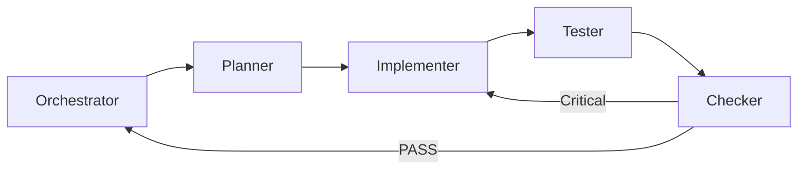

# Wave：G3 Graph 受控 Builder 计划与 Mega `/goal` 提示词（2026-08-23）

> 访问日期：2026-08-23（UTC+8）  
> 调研正文：[`g3-graph-builder-ux-research-2026-08-23.md`](g3-graph-builder-ux-research-2026-08-23.md)  
> 执行框架：[`goal-execution-framework.md`](goal-execution-framework.md)  
> 产品队列：[`product-evolution-market-ux-architecture-research.md`](product-evolution-market-ux-architecture-research.md) §7 **G3**  
> 依赖：G1/G2/G6 ✅；Menu IA ✅；Phase 7 graph + `hidden`/`excluded`  
> **不做本 Goal：** G4 全量、G5 大拆、G7/G8、新统计算法、全拖拽 JMP 克隆、嵌 R/Python

---

## §0 给 Orchestrator 的一页摘要

| 维度 | 内容 |
|------|------|
| **本 Goal 名称** | G3 Graph 受控 Builder：槽位 + geom 画廊 + 预览 → 既有 graph 装配 |
| **Wave 数** | **1 个 Wave（W1–W4 四个子项全部完成才 complete）** |
| **交付门** | `python tools/verify_g3_graph_builder_track.py` PASS |
| **人手门** | 用户 Qt Creator **Rebuild** + 目视 Builder（agent **禁止**强跑 cmake/ctest） |
| **四角色团队** | **Planner → Implementer → Tester → Checker**（互相监督；未 PASS 不得 complete） |
| **与算法 Goal 差异** | **禁止改 domain 统计公式**；核心是 UI 页 + 装配 `GraphConfiguration` + 测试 |

### 已完成水位（勿重做）

| 批次 | 内容 |
|------|------|
| G1 / G2 | 公式注册表、图表/表格复制 |
| G6 | 命令 Wizard（只推荐不执行） |
| Menu IA | 四顶层声明式菜单 |
| Phase 7 | `graph_service`、facet、hexbin、hidden/excluded 双口径基础 |

### 本 Goal 要解决的痛点

有图形命令仍难「拖着想看」；需要对标 JMP/Minitab Graph Builder 的**探索**，但保持 DataLab **受控槽位、可审计、不自动乱跑全套图**。

---

## §1 架构与改动边界

### 1.1 分层

```
ui/GraphBuilderPage 或 GraphBuilderDialog（独立；禁止塞进 MainWindow 巨型单页）
  ↓ 组装
domain::GraphConfiguration + row_visibility（hidden / excluded）
  ↓
application/GraphService（或既有图形命令 run 路径）
  ↓
OutputPage / 预览控件（既有 chart 渲染）
```

**禁止：** Builder 内直接改 domain 统计数值路径；禁止 infrastructure → ui；禁止为 Builder 新建「第二套」统计引擎。

### 1.2 竖切链路（本 Wave）

```
网上 Primary URL（已写入 g3-graph-builder-ux-research）
  → 锁定槽位 + geom 适用矩阵（research §3）
  → GraphBuilder UI（独立页）
  → 装配 GraphConfiguration → GraphService / 等价
  → MainWindow 菜单入口（图形 → Graph Builder…；chrome，勿破坏 Menu IA）
  → 双语 ui_menu_strings / ui_tr
  → tests/g3_graph_builder_track_test.cpp
  → tools/verify_g3_graph_builder_track.py
  → CMakeLists.txt
  → acceptance §2 + wiring-index + DoD md 全勾
```

### 1.3 禁止偷懒

**通用（goal-execution-framework §6）：** 1–13 全文精神适用。

**G3 增补：**

14. **禁止**全拖拽 JMP 克隆（本 Wave：列表/下拉槽位即可）  
15. **禁止**一次自动生成「所有可能图」  
16. **禁止**破坏 `hidden` vs `excluded` 语义  
17. **禁止**改 domain 回归/能力/控制图数值公式「顺便修」  
18. **禁止**混入 G4 Report Card / G5 大拆 / G7 Dashboard  
19. **禁止**无 verify + QtTest 就 complete  
20. **禁止**单页堆叠槽位+画廊+报告模板+MSA  
21. **禁止**嵌 R/Python 运行时  
22. **禁止**缩小范围为「只做空预览框」  

---

## §2 Wave 范围（4 子项 · 全部完成才 complete）

| ID | 子项 | DoD |
|----|------|-----|
| **W1** | **槽位模型 + geom 适用矩阵** | 纯逻辑或 UI 旁路可测：列型组合 → 哪些 geom 启用；覆盖 research §3.2；单元测试 ≥10 例 |
| **W2** | **GraphBuilder 独立 UI** | 独立页/对话框：列清单、X/Y/Facet/Color、geom 画廊、预览区；高级折叠；生成到输出或发布 OutputPage |
| **W3** | **接线与 i18n** | 「图形」菜单 chrome 入口；`ui_tr` / `ui_menu_strings.json`；wiring + acceptance §2 |
| **W4** | **验收门** | `tests/g3_graph_builder_track_test.cpp` + `verify_g3_graph_builder_track.py` PASS；DoD 全勾；回归 menuIA + g6 + wave4 verify |

### 明确不做

G4、G5、G7、G8、Brushing 多链、无限 Overlay、新算法、Weibayes/TreeNet、云 RTSPC。

---

## §3 优先阅读清单（开 Goal 前 · 严格按序）

| # | 路径 | 用途 |
|---|------|------|
| 1 | 本文件 + [`g3-graph-builder-ux-research-2026-08-23.md`](g3-graph-builder-ux-research-2026-08-23.md) | 范围与规则 |
| 2 | [`goal-execution-framework.md`](goal-execution-framework.md) | 多 Agent / DoD |
| 3 | [`product-evolution-market-ux-architecture-research.md`](product-evolution-market-ux-architecture-research.md) §3.1 / §7 | 产品定位 |
| 4 | `src/domain/quality_types.h`（`GraphConfiguration`、hidden/excluded） | 契约 |
| 5 | `src/application/graph_service.h` / `.cpp` | 装配与运行入口 |
| 6 | `src/ui/analysis_commands.cpp`（图形命令、facet 角色） | 已有 geom 锚点 |
| 7 | `src/ui/analysis_chart_widget.*` / 输出预览相关 | 预览复用 |
| 8 | `src/ui/command_wizard_dialog.*` | 独立对话框/分区参考（G6） |
| 9 | `src/ui/mainwindow.cpp`（菜单 / publish_page） | 入口与输出 |
| 10 | `translations/ui_menu_strings.json` | 双语 |
| 11 | `samples/product_evolution/unified_track_acceptance_plan.md` §2 | 登记 |
| 12 | 回归：`verify_ui_menu_ia_track.py`、`verify_g6_command_wizard_track.py`、`verify_algorithm_wave4_track.py` | 不得破坏 |

**开源精读（Planner 摘要进计划表，禁止大段抄进仓库）：** LabPlot、JASP Desktop、jamovi UI basic design（URL 见 research §1.1）。

**禁止误读：** `待修改.md`；`build/`。

### 竖切模板

- `src/ui/command_wizard_dialog.cpp`（独立 UI）  
- `tests/g6_command_wizard_track_test.cpp` / `tools/verify_g6_command_wizard_track.py`  
- `.agents/skills/cpp-coding/SKILL.md`（Implementer 必载）

---

## §4 四角色团队（互相监督 · 串行门禁）



| 顺序 | 角色 | subagent | 必须产出 | 未过禁止进入下一角色 |
|------|------|----------|----------|----------------------|
| 1 | **Planner** | Task explore | 槽位↔`GraphConfiguration` 字段映射表；geom 启用矩阵终稿；改动文件清单；≥10 测试用例；预览/发布调用点 | 无计划表禁止改 UI |
| 2 | **Implementer** | Task generalPurpose | W1 矩阵逻辑 + W2 页 + W3 入口/i18n/CMake；加载 cpp-coding | 禁止改 domain 公式；禁止自动跑全套图 |
| 3 | **Tester** | Task shell | QtTest + `verify_g3_graph_builder_track.py` PASS；回归 menuIA+g6+wave4 | verify 未 PASS 禁止 Checker 放行 |
| 4 | **Checker** | bugbot 或主 agent | Diff vs DoD；无 Critical；hidden/excluded 未破坏；无单页堆叠 | Critical → 回 Implementer |

**子 Agent 回复末尾固定格式：**

```text
文件列表 | DoD [x/ ] | 风险一行 | 是否破坏 menuIA/g6/wave4 verify
```

**Orchestrator：** CreateGoal 一次；立刻开干；W1–W4 连续；仅 Checker APPROVE + verify PASS 才 UpdateGoal complete。  
**不要** commit/push，除非用户明确要求。中文路径：**不**强跑 cmake/ctest。

---

## §5 测试清单（最低覆盖 · Tester）

| 层级 | 要求 |
|------|------|
| **Unit（矩阵）** | ≥10 例：scatter 启用/禁用；histogram 单列；boxplot；hexbin；空选择；facet 上限；未知列型 |
| **Unit/UI** | Builder 构造不崩溃；置灰 geom 不可触发生成；生成路径 spy/标记（不强制跑完整 PDF） |
| **Inventory** | verify：源文件、CMake、DoD `[x]`、acceptance/wiring G3、禁止空壳（须有 GraphBuilder / geom 矩阵符号） |
| **Regression** | menu IA + g6 + wave4 verify PASS |
| **手工** | X/Y 数值 → scatter 预览 → 生成到输出；换不适用 geom 应置灰 |

---

## §6 verify 脚本硬门禁（须实现）

`tools/verify_g3_graph_builder_track.py` 至少检查：

1. research + goal DoD md 存在且含 2026-08-23 / `[x]`（W1–W4）  
2. Builder UI 源文件存在（如 `graph_builder_page` 或 `graph_builder_dialog`）  
3. geom 适用矩阵源文件或同 TU 可识别符号（如 `GeomKind` / `geom_enabled` / `G3_GEOM`）  
4. CMake 含 `g3_graph_builder_track_test`  
5. acceptance §2 + wiring 含 G3  
6. QtTest 含主路径标记（如 `G3_GEOM` / `GraphBuilder`）  
7. HINT 回归：menuIA、g6、wave4  

---

## §7 交付物清单

| 产物 | 路径 |
|------|------|
| 调研 | `docs/research/g3-graph-builder-ux-research-2026-08-23.md` |
| 本计划 + Mega 提示词 | 本文件 |
| Goal 执行态 DoD | `docs/research/goal-wave-2026-08-23-g3-graph-builder.md` |
| 矩阵逻辑 | 建议 `src/application/graph_builder_geom_matrix.{h,cpp}`（无 Qt 优先）或 ui 旁路可测模块 |
| UI | 建议 `src/ui/graph_builder_page.{h,cpp}` 或 `graph_builder_dialog.*` |
| 测试 | `tests/g3_graph_builder_track_test.cpp` |
| Verify | `tools/verify_g3_graph_builder_track.py` |
| 登记 | wiring-index、acceptance §2、CMakeLists、ui_menu_strings |

---

## §8 框架结构（给执行 Agent 的心智模型）

```
┌──────────────────────────────────────────────────────────────┐
│ Orchestrator（本对话 /goal）                                  │
│  CreateGoal → TodoWrite → 串行四角色 → verify → UpdateGoal   │
└──────────────────────────────────────────────────────────────┘
         │
         ▼
┌─────────────┐   ┌──────────────┐   ┌─────────────┐   ┌──────────┐
│ Planner     │→ │ Implementer  │→ │ Tester      │→ │ Checker  │
│ 映射表+矩阵 │   │ 代码+入口    │   │ QtTest+py   │   │ Diff/DoD │
└─────────────┘   └──────────────┘   └─────────────┘   └──────────┘
         │                │                 │
         ▼                ▼                 ▼
   research §3      GraphBuilder UI    verify_g3 PASS
   GraphConfig      GraphService       回归三脚本
```

**如何继续开发（本 Goal 之后）：**

1. **G3.5（可选下一 Goal）：** Brushing / Overlay / Color 真字段  
2. **G4：** NIST 4-plot + Report Card  
3. **G5：** AnalysisService 拆分  
4. **G7/G8：** 离线监视、工作表编辑  

---

## §9 Mega `/goal` 提示词（复制到新对话整段粘贴）

````markdown
/goal

## 身份与总目标
你是 DataLab Orchestrator。用 `/goal` 模式一次做完产品 Track **G3 Graph 受控 Builder**。
**W1+W2+W3+W4 全部完成且脚本门 PASS 才允许 UpdateGoal complete。**
禁止缩小范围、禁止只做空预览框、禁止中途换模型。

工作区：DataLab（Qt/C++ 桌面统计质量软件）
人手门：中文路径 — **禁止** agent 强跑 cmake/ctest；完成后告知用户自行 Qt Creator Rebuild。
**不要** commit/push，除非用户明确要求。

---

## 本 Goal 做什么（执行清单）

**一句话：** 独立 Graph Builder 页 — 槽位（X/Y/Facet/Color）+ 按列型启用的 geom 画廊 + 预览 → 装配既有 `GraphConfiguration` / `GraphService` 生成到输出；尊重 hidden/excluded。

| ID | 必须交付 | 完成标准 |
|----|----------|----------|
| **W1** | geom 适用矩阵（纯函数优先无 Qt） | 列型组合 → 启用/禁用 geom；规则见 research §3；≥10 QtTest |
| **W2** | `GraphBuilderPage` 或等价独立对话框 | 列清单、槽位、画廊、预览、生成到输出；高级折叠；禁止 MainWindow 单页堆控件 |
| **W3** | 菜单入口 + 双语 + 文档登记 | 「图形」下 chrome「Graph Builder…」；`ui_tr` + `ui_menu_strings.json`；wiring + acceptance §2 |
| **W4** | 测试 + verify + DoD | 见下方「如何验收」 |

建议实现路径：
- 矩阵：`src/application/graph_builder_geom_matrix.{h,cpp}`
- UI：`src/ui/graph_builder_page.{h,cpp}`（或 dialog）
- 测试：`tests/g3_graph_builder_track_test.cpp`
- Verify：`tools/verify_g3_graph_builder_track.py`
- DoD：`docs/research/goal-wave-2026-08-23-g3-graph-builder.md`（逐项改 `[x]`）

---

## 明确不做
G4 Report Card / NIST 4-plot 全量、G5 AnalysisService 大拆、G7/G8、新算法、改 domain 统计公式、JMP 全 zones、无限 Overlay、Brushing 多链、嵌 R/Python、云 RTSPC、LLM 选图、一键跑全套图、Ribbon。

## 已完成水位（勿重做）
- G1/G2/G6、Menu IA、算法 Wave-4
- Phase 7：`graph_service`、facet/hexbin、hidden≠excluded

---

## 必读（严格按顺序，先读再改代码）
1. `docs/research/goal-wave-2026-08-23-g3-graph-builder-plan-and-mega-prompt.md`（本 Goal 权威计划）
2. `docs/research/g3-graph-builder-ux-research-2026-08-23.md`（规则 §3 + Primary URL + 开源清单）
3. `docs/research/goal-execution-framework.md`
4. `docs/research/product-evolution-market-ux-architecture-research.md` §3.1 / §7
5. `src/domain/quality_types.h`（GraphConfiguration / hidden_rows / excluded_rows）
6. `src/application/graph_service.h` / `.cpp`
7. `src/ui/analysis_commands.cpp`（图形命令与 facet）
8. `src/ui/mainwindow.cpp`（菜单 / publish_page）
9. `src/ui/command_wizard_dialog.*`（独立 UI 参考）
10. `translations/ui_menu_strings.json`
11. `docs/algorithm-wiring-index.md`
12. `samples/product_evolution/unified_track_acceptance_plan.md` §2

竖切模板：`tests/g6_command_wizard_track_test.cpp`、`tools/verify_g6_command_wizard_track.py`  
Implementer 必载：`.agents/skills/cpp-coding/SKILL.md`  
禁止误读：`待修改.md`、`build/`

开源精读意图（Planner 摘要，禁止大段抄仓）：LabPlot、JASP Desktop、jamovi UI；URL 见 research §1.1。

---

## 架构约束
```
ui/GraphBuilder*
  → application/geom 矩阵（纯逻辑）
  → GraphConfiguration + GraphService（或既有图形 run）
禁止：改 domain 统计公式；infrastructure → ui
禁止：破坏 row_visibility hidden/excluded
禁止：Wizard/Builder 静默批量 AnalysisService 乱调与质量主路径无关的命令
```

---

## 四角色团队（互相监督 · 串行门禁）

| 顺序 | 角色 | subagent | 必须产出 | 未过禁止进入下一角色 |
|------|------|----------|----------|----------------------|
| 1 | **Planner 计划** | Task explore | 字段映射表 + geom 矩阵终稿 + 改动文件清单 + ≥10 测试用例 + 预览/发布调用点 | 无计划表禁止改 UI |
| 2 | **Implementer 执行** | Task generalPurpose | 矩阵+Builder+入口+i18n+CMake | 禁止改 domain 公式；禁止空壳 |
| 3 | **Tester 测试** | Task shell | QtTest + verify_g3 PASS；回归 menuIA+g6+wave4 | verify 未 PASS 禁止 Checker |
| 4 | **Checker 检查** | bugbot 或主 agent | Diff vs DoD；无 Critical | Critical → 回 Implementer |

每个子 Agent 回复末尾固定格式：
`文件列表 | DoD [x/ ] | 风险一行 | 是否破坏 menuIA/g6/wave4 verify`

Orchestrator：CreateGoal 一次；立刻开干；同一会话连续到 W4；只有 Checker APPROVE + verify PASS 才 UpdateGoal complete。

---

## 禁止偷懒（必须遵守）
通用：goal-execution-framework.md §6（1–13）。  
G3 增补：
14. 禁止全拖拽 JMP 克隆  
15. 禁止一键跑全套图  
16. 禁止破坏 hidden/excluded  
17. 禁止改 domain 数值路径  
18. 禁止混入 G4/G5/G7  
19. 禁止无 verify + QtTest 就 complete  
20. 禁止单页堆叠多层主流程控件  
21. 禁止嵌 R/Python  
22. 禁止只做空预览框 complete  

---

## 如何验收（脚本门 + 人手门）

### 脚本门（agent 必须跑绿）
```powershell
python tools/verify_g3_graph_builder_track.py
python tools/verify_ui_menu_ia_track.py
python tools/verify_g6_command_wizard_track.py
python tools/verify_algorithm_wave4_track.py
```

### QtTest 最低覆盖（≥10 例矩阵）
- scatter：双 numeric 启用  
- histogram：单 numeric 启用  
- boxplot：numeric±categorical  
- hexbin：双 numeric  
- 不适用组合置灰/拒绝  
- 空选择拒绝  
- facet_max_panels 上限  
- hidden/excluded 契约标记或行为断言  

### 人手门（只告知用户，agent 不跑）
Qt Creator Rebuild → 图形 → Graph Builder → 选 X/Y 数值 → scatter 预览 → 生成到输出。

---

## 如何记录（做完必须写回）
1. `docs/research/goal-wave-2026-08-23-g3-graph-builder.md` — DoD 全 `[x]`  
2. `samples/product_evolution/unified_track_acceptance_plan.md` §2 — G3 行脚本预检 ✅、Track 交付 ✅、统一验收 ⏳  
3. `docs/algorithm-wiring-index.md` — 增加 G3 能力行  
4. 会话结束告诉用户：改了哪些文件、如何 Rebuild、人手看什么  

---

## 启动顺序（本回合立刻执行）
1. CreateGoal（objective 写清 G3 W1–W4 + verify 门）  
2. TodoWrite 列出 W1–W4 + 四角色  
3. 启动 **Planner** explore（无计划表禁止改 UI）  
4. 串行 Implementer → Tester → Checker  
5. 全绿后 UpdateGoal complete；否则保持 active 继续修  

中间不要换模型。开始执行。
````

---

## §10 给人类的使用说明

1. **新开 Cursor 对话**，粘贴 §9 整段（含开头 `/goal`）。  
2. 可附加 skill：`goal`（若环境支持）。  
3. 执行期间你只需：**Rebuild 手测**；不要在中途要求缩小范围。  
4. 本 Goal **不**自动 commit；需要时你再说「git一下」。

---

**文档状态：** 2026-08-23 首版；与 G6 计划同构，供下一会话 `/goal` 直接执行。
