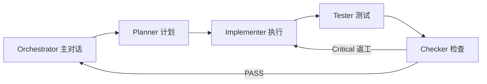

# Wave：G6 命令 Wizard（选型推荐）计划与 Mega `/goal` 提示词（2026-08-23）

> 访问日期：2026-08-23（UTC+8）  
> 调研正文：[`g6-command-wizard-ux-research-2026-08-23.md`](g6-command-wizard-ux-research-2026-08-23.md)  
> 执行框架：[`goal-execution-framework.md`](goal-execution-framework.md)  
> 依赖：UI 菜单 IA ✅（[`goal-wave-2026-08-23-ui-menu-ia-layout.md`](goal-wave-2026-08-23-ui-menu-ia-layout.md)）  
> 产品队列：[`product-evolution-market-ux-architecture-research.md`](product-evolution-market-ux-architecture-research.md) §7 **G6**  
> **不做本 Goal：** G3 Graph Builder、算法 Wave-5、AIAG–VDA 能力语义大改、LLM

---

## §0 给 Orchestrator 的一页摘要

| 维度 | 内容 |
|------|------|
| **本 Goal 名称** | G6 命令 Wizard：按列类型 + 意图推荐分析命令（只推荐，不黑盒执行） |
| **Wave 数** | **1 个 Wave（W1–W4 四个子项全部完成才 complete）** |
| **交付门** | `python tools/verify_g6_command_wizard_track.py` PASS |
| **人手门** | 用户 Qt Creator **Rebuild** + 目视 Wizard（agent **禁止**强跑 cmake/ctest；中文路径） |
| **四角色团队** | **Planner → Implementer → Tester → Checker**（互相监督；未 PASS 不得 complete） |
| **与算法 Goal 差异** | **禁止改 domain 统计公式**；核心是推荐引擎 + 独立 Wizard 页 + 测试 |

### 已完成水位（勿重做）

| 批次 | 内容 |
|------|------|
| 算法 Wave-2～4 | 质量/可靠性/logistic stepwise 等竖切 |
| G1 / G2 | 公式注册表、图表/表格复制 |
| UI Menu IA | 声明式 `menu_path`/`menu_group`；四顶层菜单 |

### 本 Goal 要解决的痛点

有菜单分组仍难「从数据想到该点哪个命令」；需要对标 QI Macros / Minitab Assistant 的**选型**，但保持 DataLab **可审计、不自动乱跑**。

---

## §1 架构与改动边界

### 1.1 分层

```
ui/  CommandWizardDialog（独立页/对话框；禁止塞进 MainWindow 巨型单页）
  ↓ 只读
application/（或 ui 旁路）CommandRecommendationEngine 纯逻辑
  ↓ 只读命令元数据
analysis_commands::all() 的 id / label / menu_path / menu_group
  ↓
domain/ DataTable.column_types（只读）
```

**禁止：** Wizard 内直接 `AnalysisService::*` 跑分析；禁止 infrastructure → ui。

### 1.2 竖切链路（本 Wave）

```
网上 Primary URL（已写入 g6-command-wizard-ux-research）
  → 锁定推荐规则表（research §3 → 代码静态表/JSON）
  → CommandRecommendationEngine（纯函数 + 单测）
  → CommandWizardDialog（选列 / 意图 / 推荐列表 / 打开既有 setup）
  → MainWindow 菜单入口（帮助或数据/统计下「命令向导…」）
  → 双语 ui_menu_strings / ui_tr
  → help 短条目或 wiring 登记（可选 algorithm_help 一条 wizard 元说明）
  → tests/g6_command_wizard_track_test.cpp（引擎 + 可选 UI smoke）
  → tools/verify_g6_command_wizard_track.py
  → CMakeLists.txt
  → samples/product_evolution/unified_track_acceptance_plan.md §2
  → docs/research/goal-wave-2026-08-23-g6-command-wizard.md（DoD [x]）
  → docs/algorithm-wiring-index.md 增 G6 行
```

### 1.3 禁止偷懒

**通用（goal-execution-framework §6）：**

1. 禁止只做 UI 壳不算可测逻辑 — **本 Wave：推荐引擎必须可单测**  
2. 禁止跳过双语（新增 Wizard 文案 / 意图标签 / 理由键）  
3. 禁止把 Minitab/QI 数值当 golden  
4. 禁止单页堆叠超过一层主流程（Wizard 用步骤或清晰分区；高级选项折叠）  
5. 禁止破坏 `row_visibility` hidden/excluded  
6. 禁止 infrastructure 新增对 ui 的 include  
7. 禁止合并三报告模板  
8. 禁止省略 wiring / acceptance 登记  
9. 禁止大 catalog 单 TU  
10. 禁止宣称 PDF/A·UA 无验证器  
11. 禁止每项强制停 Qt Creator  
12. **禁止只做空对话框无推荐规则就 complete**  
13. **禁止跳过网上调研核对**（research md 已有则核对补全访问日期）

**G6 增补：**

14. **禁止** Wizard 自动调用 AnalysisService 跑统计或批量出图  
15. **禁止** LLM / 自由文本生成推荐理由  
16. **禁止**混入 G3 Graph Builder / Ribbon / 菜单偏好隐藏  
17. **禁止**改 domain 统计数值路径「顺便修」  
18. **禁止**推荐不存在的 command id  
19. **禁止**无 verify + QtTest 就 complete  
20. **禁止**把意图问答做成 Minitab Assistant 全量决策树（本 Wave 短意图枚举即可）

---

## §2 Wave 范围（4 子项 · 全部完成才 complete）

| ID | 子项 | DoD |
|----|------|-----|
| **W1** | **推荐引擎** | 纯函数：列类型向量 + 意图 → `vector<Recommendation>`；规则覆盖 research §3 主路径；Top-N≤8；单元测试 ≥12 用例 |
| **W2** | **Wizard UI** | 独立 `CommandWizardDialog`（或等价独立页）：选列、意图、推荐列表（显示路径+理由）、确认打开既有 `AnalysisSetup`/命令入口；**不**直接出 OutputPage |
| **W3** | **接线与 i18n** | MainWindow 菜单入口；`ui_tr` / `ui_menu_strings.json`；推荐理由可本地化；wiring + acceptance §2 |
| **W4** | **验收门** | `tests/g6_command_wizard_track_test.cpp` + `tools/verify_g6_command_wizard_track.py` PASS；DoD md 全勾；回归 `verify_ui_menu_ia_track.py` 与 `verify_algorithm_wave4_track.py` 仍 PASS |

### 明确不做

G3、G4 Report Card 全量、G5 拆分、G7/G8、新算法、Weibayes/TreeNet、云 RTSPC、一键跑全套图。

---

## §3 优先阅读清单（开 Goal 前）

| # | 路径 | 用途 |
|---|------|------|
| 1 | 本文件 + [`g6-command-wizard-ux-research-2026-08-23.md`](g6-command-wizard-ux-research-2026-08-23.md) | 范围与规则 |
| 2 | [`goal-execution-framework.md`](goal-execution-framework.md) | 多 Agent / DoD |
| 3 | [`ui-menu-ia-command-taxonomy-map-2026-08-23.md`](ui-menu-ia-command-taxonomy-map-2026-08-23.md) | 推荐展示路径同源 |
| 4 | `src/domain/quality_types.h`（`ColumnType` / `DataTable`） | 列类型 |
| 5 | `src/ui/analysis_commands.h` / `.cpp` | 命令元数据 |
| 6 | `src/ui/mainwindow.cpp`（命令触发 / setup 对话框打开路径） | 如何「打开既有分析」 |
| 7 | `src/ui/database_import_wizard.*` | 多步 Wizard UI 参考（分页/Next，勿抄数据库逻辑） |
| 8 | `src/ui/analysis_setup_dialog.*`（若存在）或当前分析对话框入口 | 推荐确认后的跳转 |
| 9 | `translations/ui_menu_strings.json` | 双语 |
| 10 | `samples/product_evolution/unified_track_acceptance_plan.md` §2 | 登记 |
| 11 | 回归：`tools/verify_ui_menu_ia_track.py`、`tools/verify_algorithm_wave4_track.py` | 不得破坏 |

**禁止误读：** `待修改.md` 为人备忘；`build/` 非源码。

### 竖切模板代码

- `src/ui/database_import_wizard.cpp`（对话框步骤模式）  
- `tests/ui_menu_ia_track_test.cpp`（UI Track 测试风格）  
- `tools/verify_ui_menu_ia_track.py`（verify 脚本风格）  
- `.agents/skills/cpp-coding/SKILL.md`（Implementer 必载）

---

## §4 四角色团队（互相监督）

> 用户指定：**计划 / 执行 / 测试 / 检查** 四角色。未形成交付证据不得 `UpdateGoal complete`。



| 顺序 | 角色 | subagent | 职责 | 门禁（未过禁止进入下一角色） |
|------|------|----------|------|------------------------------|
| 1 | **Planner（计划）** | `explore` | 核对 research；产出「规则表终稿 + 文件改动清单 + 测试用例清单」；标清打开既有分析的调用点 | **无计划表禁止改 UI** |
| 2 | **Implementer（执行）** | `generalPurpose` | 实现引擎 + Wizard + 菜单入口 + i18n；加载 cpp-coding | 禁止改 domain 公式；禁止自动跑分析 |
| 3 | **Tester（测试）** | `shell` + 可写测试文件 | 编写/补齐 QtTest；实现 `verify_g6_command_wizard_track.py`；跑 verify（含 menu IA + wave4 回归） | **verify 未 PASS 禁止 Checker 放行** |
| 4 | **Checker（检查）** | `bugbot` 或主 agent 自查 | Diff vs DoD；无自动执行；无非法 id；深度/单页堆叠；Critical 返工 | Critical → 回 Implementer |

**子 Agent 统一交付格式：**

```text
文件列表 | DoD [x/ ] | 风险一行 | 是否破坏 menuIA/wave4 verify
```

**Orchestrator 纪律：**

- 同一 `/goal` 会话连续做到 W1–W4 全完；禁止「只做引擎壳」就 complete。  
- 中文路径：**不**强跑 cmake/ctest。  
- **不要** commit/push，除非用户明确要求。

---

## §5 测试清单（最低覆盖 · Tester 负责）

| 层级 | 要求 |
|------|------|
| **Unit（引擎）** | ≥12 例：1 列 numeric、2 列 numeric、numeric+categorical、intent=control_chart、intent=capability、全 unknown、空选择、Top-N 截断、推荐 id 皆可 `find` |
| **Unit/UI** | 对话框构造不崩溃；确认动作触发「打开命令」回调（可用 spy/信号），**不**创建 OutputPage |
| **Inventory** | verify：源文件存在、CMake 注册、research/DoD md、禁止 `AnalysisService::` 出现在 Wizard/引擎实现文件（允许注释说明） |
| **Regression** | `verify_ui_menu_ia_track.py` + `verify_algorithm_wave4_track.py` PASS |
| **手工** | 选测量列 → 推荐含 descriptive/histogram；点选 → 弹出既有设置对话框 |

---

## §6 verify 脚本硬门禁（须实现）

`tools/verify_g6_command_wizard_track.py` 至少检查：

1. research + goal DoD md 存在且含访问日期 / `[x]`  
2. 推荐引擎源文件 + Wizard 源文件存在  
3. `tests/g6_command_wizard_track_test.cpp` 在 CMake 注册  
4. 引擎文件内可解析到规则或测试覆盖标记（如 `recommend` / `Recommendation`）  
5. Wizard/引擎 `.cpp` **不**包含 `AnalysisService::` 调用（正则门禁）  
6. acceptance §2 含 G6；wiring 含 G6  
7. 调用 menu IA + wave4 verify 或确认其仍 PASS  

---

## §7 交付物清单

| 产物 | 路径 |
|------|------|
| 调研 | `docs/research/g6-command-wizard-ux-research-2026-08-23.md` |
| 本计划 + Mega 提示词 | 本文件 |
| Goal 执行态 DoD | `docs/research/goal-wave-2026-08-23-g6-command-wizard.md` |
| 引擎 | 建议 `src/application/command_recommendation_engine.{h,cpp}` 或 `src/ui/command_recommendation_engine.*`（无 Qt 依赖优先 application） |
| UI | `src/ui/command_wizard_dialog.{h,cpp}` |
| 测试 | `tests/g6_command_wizard_track_test.cpp` |
| Verify | `tools/verify_g6_command_wizard_track.py` |
| 登记 | wiring-index、acceptance §2、CMakeLists |

---

## §8 Mega `/goal` 提示词（复制到新对话）

````markdown
/goal

## 范围（W1+W2+W3+W4 全部完成才 complete — 禁止只做空对话框）

**本 Goal：G6 命令 Wizard — 按列类型 + 意图推荐分析命令（只推荐，不自动执行）**

**W1 推荐引擎**
- 纯函数：选中列的 `ColumnType` + 可选意图 → Top-N（≤8）推荐
- 规则权威：`docs/research/g6-command-wizard-ux-research-2026-08-23.md` §3
- 每条推荐：`command_id` + 理由 + 展示 `menu_path > menu_group`（来自 AnalysisCommand）
- 推荐 id 必须能 `analysis_commands::find`；禁止幽灵 id
- QtTest ≥12 例覆盖主路径

**W2 Wizard UI**
- 独立 `CommandWizardDialog`（参考 `database_import_wizard` 分页/分区；禁止塞进 MainWindow 单页堆控件）
- 流程：选列 → 选意图（短枚举）→ 看推荐列表 → 用户确认 → **打开既有分析设置对话框/命令**
- **禁止**在 Wizard 内调用 `AnalysisService::*` 跑分析或批量出图

**W3 接线与 i18n**
- MainWindow 增加入口（如「统计 → 命令向导…」或「帮助/数据」下；勿破坏 Menu IA 四顶层）
- `ui_tr` + `translations/ui_menu_strings.json` 双语
- 更新 `docs/algorithm-wiring-index.md`、acceptance §2

**W4 验收**
- `tests/g6_command_wizard_track_test.cpp` + CMake
- `tools/verify_g6_command_wizard_track.py` PASS
- `docs/research/goal-wave-2026-08-23-g6-command-wizard.md` DoD 全 `[x]`
- 回归：`python tools/verify_ui_menu_ia_track.py` 与 `python tools/verify_algorithm_wave4_track.py` 仍 PASS

## 明确不做
G3 Graph Builder、G4 Report Card 全量、G5 拆分、G7/G8、新算法、改 domain 统计公式、Weibayes/TreeNet、LLM 推荐、QI Macros 式一键跑全套图、Minitab Assistant 全决策树克隆

## 上一阶段已完成（勿重做）
- UI Menu IA：声明式菜单；`verify_ui_menu_ia_track.py` PASS
- 算法 Wave-4：`verify_algorithm_wave4_track.py` PASS
- G1/G2：公式注册表、复制图表/表格

## 现状根因（必须对着修）
- 137 命令仅靠菜单浏览，缺少「从列到命令」的选型层
- 市场 Wizard 常「自动跑」——与 DataLab 可审计竖切冲突，本 Goal 只做推荐

## 禁止偷懒
1–13：粘贴 goal-execution-framework.md §6  
14. 禁止 Wizard 自动调用 AnalysisService  
15. 禁止 LLM 生成理由  
16. 禁止混入 G3/Ribbon  
17. 禁止改 domain 数值  
18. 禁止推荐不存在的 command id  
19. 禁止无 verify + QtTest 就 complete  
20. 禁止做成全量 Assistant 决策树  

## 四角色团队（互相监督 · 未 PASS 不得 complete）
| 顺序 | 角色 | subagent | 门禁 |
|------|------|----------|------|
| 1 | Planner 计划 | explore | 规则表+改动清单+测试用例清单；无表禁止改 UI |
| 2 | Implementer 执行 | generalPurpose | 引擎+Wizard+入口+i18n；加载 cpp-coding |
| 3 | Tester 测试 | shell（可写测试/verify） | verify_g6 PASS + 回归 menuIA/wave4 |
| 4 | Checker 检查 | bugbot 或主 agent 自查 | Critical 返工 |

子 Agent 交付：`文件列表 | DoD [x/ ] | 风险一行 | 是否破坏 menuIA/wave4 verify`  
Implementer 加载：`.agents/skills/cpp-coding/SKILL.md`

## 架构
- 推荐引擎纯逻辑（优先无 Qt）→ Wizard 只展示与跳转
- 打开分析走现有命令/对话框路径
- 人手门：告知用户 Qt Creator Rebuild；agent 禁止强跑 cmake/ctest
- 不要 commit/push，除非用户明确要求

## 必读（按顺序）
1. docs/research/goal-wave-2026-08-23-g6-command-wizard-plan-and-mega-prompt.md
2. docs/research/g6-command-wizard-ux-research-2026-08-23.md
3. docs/research/goal-execution-framework.md
4. docs/research/ui-menu-ia-command-taxonomy-map-2026-08-23.md
5. src/domain/quality_types.h（ColumnType）
6. src/ui/analysis_commands.h / .cpp
7. src/ui/mainwindow.cpp（如何触发分析命令）
8. src/ui/database_import_wizard.h/.cpp（Wizard UI 参考）
9. docs/algorithm-wiring-index.md
10. samples/product_evolution/unified_track_acceptance_plan.md §2

## 竖切模板
- src/ui/database_import_wizard.cpp
- tests/ui_menu_ia_track_test.cpp
- tools/verify_ui_menu_ia_track.py

## 交付物
- docs/research/goal-wave-2026-08-23-g6-command-wizard.md（DoD 逐项 [x]）
- tools/verify_g6_command_wizard_track.py PASS
- tests/g6_command_wizard_track_test.cpp
- 引擎 + CommandWizardDialog + 菜单入口 + wiring + acceptance §2
中间不要换模型
````

---

## §9 后续候选（本 Goal 完成后 · 勿混进本 Wave）

| 候选 | 说明 |
|------|------|
| **G3** Graph 受控 Builder | 独占 Goal；市场最大体验缺口 |
| **SPC 2026 门控** | AIAG–VDA：稳态后才 Cp/Cpk、Pm/Pmk 窄化；质量差异化 |
| **G4** 4-plot / Report Card | 假设可视化 |
| **G5** AnalysisService 拆分 | 可维护性 |
| **G7** 离线监视摘要 | 学 RTSPC 呈现 |
| 算法 Wave-5 | Weibayes 等；与 G6 **分开** |

---

## §10 给用户的「如何开下一对话」

1. 新对话粘贴 **§8** 全文（含 `/goal`）。  
2. 附加 skill：`goal`（若环境支持）+ 提醒 Implementer 用 `cpp-coding`。  
3. 你本地只在脚本 PASS 后做一次 Qt Rebuild 目视。  
4. 不要在本 Goal 里要求顺手做 G3/算法。

---

**文档状态：** 2026-08-23 首版；§8 可直接复制到新对话 `/goal`。
