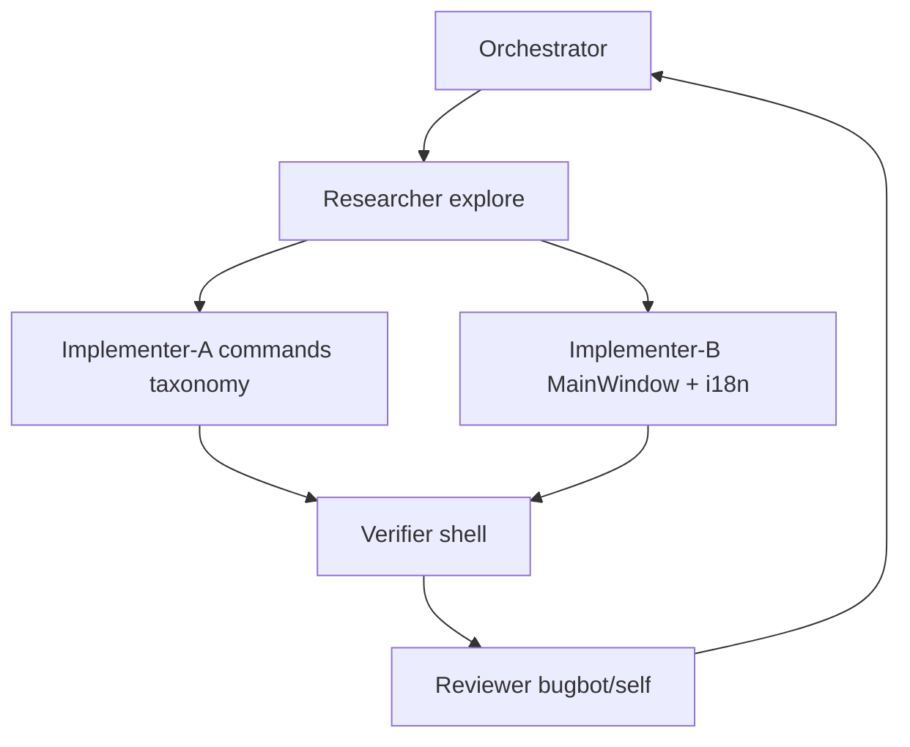

# Wave：UI 菜单信息架构整理 + 布局优化计划与 Mega `/goal` 提示词（2026-08-23）

> 访问日期：2026-08-23（UTC+8）  
> 调研正文：[`ui-menu-ia-minitab-taxonomy-2026-08-23.md`](ui-menu-ia-minitab-taxonomy-2026-08-23.md)  
> 执行框架：[`goal-execution-framework.md`](goal-execution-framework.md)  
> 上一算法 Goal：[`goal-wave-2026-08-22-algorithm-wave4-quality-reliability-deepen.md`](goal-wave-2026-08-22-algorithm-wave4-quality-reliability-deepen.md) ✅（勿重做算法竖切）  
> 产品队列：[`product-evolution-market-ux-architecture-research.md`](product-evolution-market-ux-architecture-research.md)（G3 仍延后）

---

## §0 给 Orchestrator 的一页摘要

| 维度 | 内容 |
|------|------|
| **本 Goal 名称** | UI Menu IA：算法分类进子菜单 + 菜单声明式改造 + 轻量布局一致性 |
| **Wave 数** | **1 个 Wave（3 子项必须全部完成才 complete）** |
| **交付门** | `python tools/verify_ui_menu_ia_track.py` PASS |
| **人手门** | 用户 Qt Creator **Rebuild** + 目视菜单（agent **禁止**强跑 cmake/ctest；中文路径） |
| **子 Agent** | Researcher → Implementer-A（taxonomy/data）∥ Implementer-B（MainWindow/tr）→ Verifier → Reviewer |
| **与算法 Goal 差异** | **禁止改 domain 统计公式**；测试侧重菜单树/命令表，不是 A→B 数值 |

### 已完成水位（勿重做）

| 批次 | 内容 |
|------|------|
| Wave-2/2.5/3/4 | 算法竖切与 deepen；`verify_algorithm_wave*_track.py` |
| G1/G2 | 公式注册表、图表复制 |
| 菜单雏形 | `menu_path` + `analysis_menu_group()` 部分硬编码二级 |

### 本 Goal 要解决的痛点

点开「统计」出现 **超长扁平列表**；Wave 新增命令多数未进 `analysis_menu_group()` 白名单。

---

## §1 架构与改动边界

### 1.1 仍遵守的分层

```
ui/（MainWindow 菜单构建、AnalysisCommand 表）
  ↓ 不改调用约定
application/ AnalysisService::*（本 Wave 原则上不改）
  ↓
domain/（禁止为本 Wave 改统计实现）
```

### 1.2 本 Wave 竖切链路（UI 专用）

```
WebSearch / 已有 taxonomy md（Primary URL）
  → docs/research/ui-menu-ia-minitab-taxonomy-2026-08-23.md（已写则核对补全）
  → 全量命令 taxonomy 表（command_id → menu_path → menu_group）写入 research 附录或独立 csv/md
  → src/ui/analysis_commands.cpp/.h：填充 menu_group；校正 menu_path
  → src/ui/mainwindow.cpp：按字段建菜单；移除/收缩硬编码白名单
  → 双语：ui_tr / ui_menu_strings.json / .ts（按仓库现有流程）
  → resources/help/algorithm_help.json menu_path 对齐（脚本可批量）
  → docs/algorithm-wiring-index.md 菜单列（若有）
  → tests/ui_menu_ia_track_test.cpp
  → tools/verify_ui_menu_ia_track.py
  → CMakeLists.txt
  → samples/product_evolution/unified_track_acceptance_plan.md §2
  → docs/research/goal-wave-2026-08-23-ui-menu-ia-layout.md（DoD 勾选）
```

### 1.3 禁止偷懒（全文粘贴 · UI Wave 增补）

**通用（goal-execution-framework §6）：**

1. 禁止只做 UI 壳不算 domain/Facts — **本 Wave 例外说明：允许纯 UI，但必须有声明式数据 + 测试 + verify；禁止「只改样式不分类」**  
2. 禁止跳过 interpretation 与 catalog 双语 — **本 Wave：新增菜单分组标签必须双语**  
3. 禁止把 Minitab 数值当 golden  
4. 禁止单页堆叠超过一层主流程控件  
5. 禁止破坏 `row_visibility` hidden/excluded 语义  
6. 禁止 infrastructure 新增对 ui 的 include  
7. 禁止合并 customer/engineer/audit 为单模板  
8. 禁止省略 help catalog / `algorithm_help.json`（菜单路径同步）  
9. 禁止大 catalog 单 TU（>500 条）  
10. 禁止宣称 PDF/A·UA 合规无验证器  
11. 禁止每 Wave 强制停 Qt Creator 才允许下一 Wave  
12. **禁止 Goal 在只完成「统计」一个顶层后标记 complete**  
13. **禁止跳过网上 Primary URL 调研**

**UI Wave 增补：**

14. **禁止**继续用巨型 `if (id == …)` 作为唯一分组源（须声明式 `menu_group`）  
15. **禁止**三级及以上悬停级联菜单  
16. **禁止**改动任意算法 domain 数值路径「顺便修一下」  
17. **禁止**把 Graph Builder / G3 混进本 Goal  
18. **禁止**遗漏 Wave-2～4 新命令（cox / bootstrap_two_sample / logistic stepwise 入口等）  
19. **禁止**只改中文菜单不改 `algorithm_help.json` / wiring  
20. **禁止**无 verify 脚本与 QtTest 就宣称完成  

---

## §2 Wave 范围（3 子项 · 全部完成才 complete）

| ID | 子项 | DoD |
|----|------|-----|
| **U1** | **声明式菜单数据** | 每个分析 `AnalysisCommand` 有正确 `menu_path` + 非空 `menu_group`（控制图/质量工具/图形/统计均覆盖）；taxonomy 附录与实现对齐 |
| **U2** | **MainWindow 渲染改造** | 按字段构建子菜单；硬编码白名单删除或 ≤10 行特例表；顶层「统计」打开后以子菜单为主，叶命令不再「一屏刷爆」 |
| **U3** | **一致性与验收** | help `menu_path` 同步；`verify_ui_menu_ia_track.py` PASS；`ui_menu_ia_track_test`；acceptance §2；goal-wave DoD md |

### 可选轻量布局（同一 Wave 内若有余力 · 不替代 U1–U3）

- 菜单样式已有 QSS：仅微调间距/分隔，**不做**视觉大改版  
- AnalysisSetupDialog：确认「主要选项 / 高级选项」分组仍生效（已有 `InputSpec.group`），不堆新页  

### 明确不做

Weibayes、Graph Builder、菜单偏好隐藏（JMP）、Ribbon、算法新功能。

---

## §3 优先阅读清单（开 Goal 前 20 分钟）

| # | 路径 | 用途 |
|---|------|------|
| 1 | [`ui-menu-ia-minitab-taxonomy-2026-08-23.md`](ui-menu-ia-minitab-taxonomy-2026-08-23.md) | 分类树与 Primary URL |
| 2 | [`goal-execution-framework.md`](goal-execution-framework.md) | 多 Agent / DoD |
| 3 | `src/ui/analysis_commands.h` / `.cpp` | 命令表、`menu_path`/`menu_group` |
| 4 | `src/ui/mainwindow.cpp` → `primary_analysis_menu` / `analysis_menu_group` / 菜单构建循环 | **改造中心** |
| 5 | `resources/help/algorithm_help.json` | `menu_path` 字段 |
| 6 | `docs/algorithm-wiring-index.md` | 登记 |
| 7 | `translations/ui_menu_strings.json`（若存在） | 双语 |
| 8 | 上一 Wave verify：`tools/verify_algorithm_wave4_track.py` | **回归：不得破坏** |

**禁止误读：** `待修改.md` 为人备忘；`build/` 非源码。

---

## §4 多 Agent 分工（互相监督）



| 顺序 | 角色 | subagent | 职责 | 门禁 |
|------|------|----------|------|------|
| 1 | Researcher | explore | 核对 taxonomy md；产出「全量 command_id → path/group」表；标出当前未分组 id | **无表禁止改 MainWindow** |
| 2 | Implementer-A | generalPurpose | 只改 `analysis_commands.cpp/.h` + help menu_path 批量对齐 | 禁止同时大改 mainwindow |
| 3 | Implementer-B | generalPurpose | `mainwindow.cpp` 渲染 + 双语键；串行合并 | 必须读命令字段 |
| 4 | Verifier | shell | `verify_ui_menu_ia_track.py` | **PASS 才 Review** |
| 5 | Reviewer | bugbot（额度不足则主 agent 自查） | Diff：无 domain 滥改；深度≤1；Wave 命令有归宿 | Critical 返工 |

**子 Agent 交付格式：** `文件列表 | DoD [x/ ] | 风险一行 | 是否破坏算法 verify`

**Implementer 加载：** `.agents/skills/cpp-coding/SKILL.md`（UI/C++ 风格）

---

## §5 测试清单（最低覆盖）

| 层级 | 要求 |
|------|------|
| **Unit** | 构建菜单模型（可抽纯函数 `build_analysis_menu_tree(commands)`）：每个 id 恰好出现一次；group 非空 |
| **Regression** | `verify_algorithm_wave3_track.py` / `wave4` 仍 PASS |
| **Inventory** | verify 脚本：统计顶层「直接叶命令」数量 ≤ 阈值（建议 0～3）；列出未分组 FAIL |
| **i18n** | 新增分组中文有英文对应（按现有 tr 机制） |
| **手工** | 统计→回归 可见 logistic / stepwise / cox 不在；cox 在可靠性；控制图四级分组可扫读 |

---

## §6 verify 脚本硬门禁（须实现）

`tools/verify_ui_menu_ia_track.py` 至少检查：

1. `analysis_commands.cpp` 中每个分析命令 id 可解析出 `menu_group`（或静态表完整）  
2. `mainwindow.cpp` **不再**包含超长 id 白名单（或白名单行数 ≤ 阈值）  
3. taxonomy / goal DoD md 存在  
4. `tests/ui_menu_ia_track_test.cpp` 在 CMake 中注册  
5. 抽样：`cox_regression`→可靠性；`logistic_regression`→回归；`imr`→控制图；`nonparametric_capability`→质量工具/过程能力  
6. Wave-4 verify 仍可调用或至少文件存在不回退  

---

## §7 交付物清单

| 产物 | 路径 |
|------|------|
| 调研 | `docs/research/ui-menu-ia-minitab-taxonomy-2026-08-23.md` |
| Goal 执行态 | `docs/research/goal-wave-2026-08-23-ui-menu-ia-layout.md`（DoD `[x]`） |
| Verify | `tools/verify_ui_menu_ia_track.py` |
| 测试 | `tests/ui_menu_ia_track_test.cpp` |
| 代码 | `analysis_commands.*`, `mainwindow.cpp`, help json, translations |
| 登记 | wiring-index、acceptance §2、roadmap 一行（产品 Track） |

---

## §8 Mega `/goal` 提示词（复制到新对话）

````markdown
/goal

## 范围（U1+U2+U3 全部完成才 complete — 禁止只改一个顶层菜单就停）

**本 Goal：UI 菜单信息架构（IA）整理 — 算法分类进对应子菜单，缩短扁平目录**

**U1 声明式菜单数据**
- 全量 `AnalysisCommand` 填写 `menu_path` + `menu_group`
- 分类权威：`docs/research/ui-menu-ia-minitab-taxonomy-2026-08-23.md` §3
- 不得遗漏 Wave-2～4 命令（含 `cox_regression`、`bootstrap_two_sample`、`probit_reliability`、`accelerated_life`、`nominal_logistic`、`nonparametric_capability`、`stepwise_regression`、`kmeans`、`cluster_observations` 等）

**U2 MainWindow 渲染**
- 按命令字段构建：顶层 → 一级子菜单(group) → 叶命令
- 删除/收缩 `analysis_menu_group()` / `primary_analysis_menu()` 硬编码白名单
- 级联深度硬上限 = 1；禁止三层悬停
- 顶层保持：统计 / 控制图 / 质量工具 / 图形（+ 文件编辑数据查看帮助不动）

**U3 一致性与验收**
- `algorithm_help.json` menu_path 对齐
- `tests/ui_menu_ia_track_test.cpp` + `tools/verify_ui_menu_ia_track.py` PASS
- 更新 acceptance §2、wiring、goal-wave DoD md
- 回归：`python tools/verify_algorithm_wave4_track.py` 仍 PASS

## 明确不做
Graph Builder(G3)、JMP 菜单偏好隐藏、Ribbon、新算法、改 domain 统计公式、Weibayes/TreeNet

## 上一阶段已完成（勿重做算法）
- Wave-4：nonparametric PPM/hist、CIF/Gray、cox_regression、logistic stepwise
- verify：`tools/verify_algorithm_wave4_track.py` PASS
- 详见：`docs/research/goal-wave-2026-08-22-algorithm-wave4-quality-reliability-deepen.md`

## 现状根因（必须对着修）
- `src/ui/mainwindow.cpp`：`analysis_menu_group()` 硬编码；未列入的命令扁平挂在「统计」
- `AnalysisCommand.menu_group` 字段已存在但未成为唯一数据源
- 「统计」下约 60+ 命令，体验差

## 禁止偷懒
1–13：粘贴 goal-execution-framework.md §6  
14. 禁止巨型 id 白名单作为唯一分组源  
15. 禁止三级及以上级联  
16. 禁止顺便改 domain 算法数值  
17. 禁止混入 Graph Builder  
18. 禁止遗漏 Wave 新命令归类  
19. 禁止不同步 help / wiring  
20. 禁止无 verify + QtTest 就 complete  

## 多 Agent（互相监督 · 未 PASS 不得 complete）
| 顺序 | 角色 | subagent | 门禁 |
|------|------|----------|------|
| 1 | Researcher | explore | 全量 id→path/group 表；无表禁止改 UI |
| 2 | Implementer-A | generalPurpose | 只改 analysis_commands + help 路径 |
| 3 | Implementer-B | generalPurpose | mainwindow + i18n（串行） |
| 4 | Verifier | shell | verify_ui_menu_ia_track.py PASS |
| 5 | Reviewer | bugbot 或主 agent 自查 | Critical 返工 |

子 Agent 交付：`文件列表 | DoD [x/ ] | 风险一行 | 是否破坏 wave4 verify`  
Implementer 加载：`.agents/skills/cpp-coding/SKILL.md`

## 架构
- ui 声明式命令表 → MainWindow 只渲染
- 不改 AnalysisService 算法逻辑
- 人手门：告知用户 Qt Creator Rebuild；agent 禁止强跑 cmake/ctest
- 不要 commit/push，除非用户明确要求

## 必读（按顺序）
1. docs/research/goal-wave-2026-08-23-ui-menu-ia-layout-plan-and-mega-prompt.md
2. docs/research/ui-menu-ia-minitab-taxonomy-2026-08-23.md
3. docs/research/goal-execution-framework.md
4. src/ui/analysis_commands.h
5. src/ui/mainwindow.cpp（primary_analysis_menu / analysis_menu_group / 菜单构建）
6. docs/algorithm-wiring-index.md
7. samples/product_evolution/unified_track_acceptance_plan.md §2

## 竖切模板代码
- src/ui/analysis_commands.cpp（命令行追加方式）
- src/ui/mainwindow.cpp（菜单循环 ~497 行附近）
- tools/verify_algorithm_wave4_track.py（verify 脚本风格）
- tests/algorithm_wave4_track_test.cpp（QtTest 风格）

## 交付物
- docs/research/goal-wave-2026-08-23-ui-menu-ia-layout.md（DoD 逐项 [x]）
- tools/verify_ui_menu_ia_track.py PASS
- tests/ui_menu_ia_track_test.cpp
- 更新：analysis_commands、mainwindow、algorithm_help.json、wiring、acceptance §2
中间不要换模型
````

---

## §9 后续候选（本 Goal 完成后）

| 候选 | 说明 |
|------|------|
| G6 命令 Wizard | 按列类型推荐命令（依赖清晰 IA） |
| G3 Graph Builder | 独占 Goal |
| JMP 式 Menu Preferences | 隐藏整族菜单 |
| 算法 Wave-5 | 与 UI Goal **分开**，勿混 Wave |

---

**文档状态：** 2026-08-23 首版；§8 可直接复制到新对话 `/goal`。
